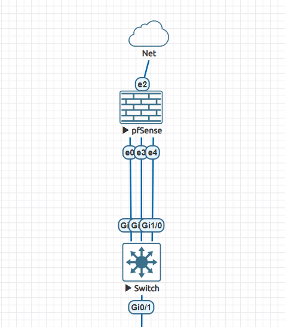
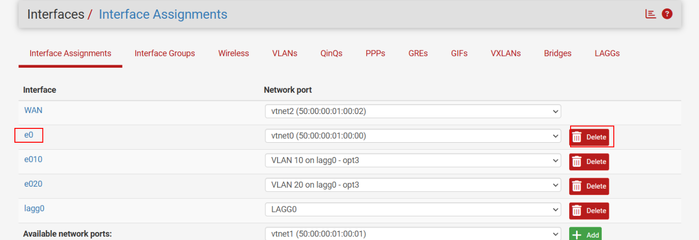
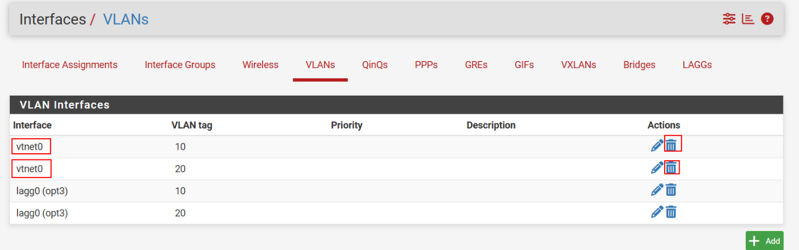

# Cấu hình LACP giữa 2 đầu CoreSw và pfSense

## Topology ban đầu


- Trên interface G0/0 của CoreSw:

    - Cấu hình mode trunk allow vlan 10, 20

    - Native vlan 1

- Trên interface e0 của pfSense:

    - sub-interface e0.10 vlan 10: 192.168.10.1/24

    - sub-interface e0.20 vlan 20: 192.168.20.1/24

## Nối thêm dây giữa CoreSw và pfSense để cấu hình LACP

  


### Trên 2 dây mới G0/3 và G1/0 của CoreSw

- Cấu hình trunk 

```
Coresw(config-vlan)#int range g0/3,g1/0
Coresw(config-if-range)#sw trunk encapsulation dot1q
Coresw(config-if-range)#sw mode trunk
Coresw(config-if-range)#sw trunk all vlan 10,20
```

- Cấu hình LACP trên 2 cổng mới của CoreSw

```
Coresw(config)#int range g0/3,g1/0
Coresw(config-if-range)#sw trunk encapsulation dot1q
Coresw(config-if-range)#sw mode trunk
Coresw(config-if-range)#sw trunk all vlan 10,20
Coresw(config-if-range)#exit
Coresw(config)#int range g0/3,g1/0
Coresw(config-if-range)#channel-group 1 mode active
Creating a port-channel interface Port-channel 1


Coresw(config)#int port-channel 1
Coresw(config-if)#sw trunk encapsulation dot1q
Coresw(config-if)#sw mode trunk
Coresw(config-if)#sw trunk all vlan 10,20
```

### Trên pfSense 
- Vào Interfaces -> LAGGs, bấm Add -> thêm e3,e4 (e3,e4 là 2 cổng mới thêm vào trên pfsense và lấy riêng 2 cổng mới đó cấu hình lagg)

    


- Vào Interfaces > VLANs, tạo sub-interfaces vlan trên nền của LAGG e3,e4 vừa tạo


- Vào Interfaces/Interface Assignments, add thêm interface lagg0 và enable nó lên 


- Vào Interface/ interface Assignments để thay thế các sub-interface vlan cũ bằng sub-interface vlan vừa tạo 


 

- Xoá interface cũ : e0 và các sub-interface của nó




