# Cấu hình LACP giữa 2 đầu CoreSw và pfSense

sequenceDiagram
    participant PC as Mạng LAN (PC)
    participant SW as Core Switch
    participant PF as pfSense Firewall

    Note over PC,PF: GIAI ĐOẠN 1: BAN ĐẦU
    PC->>SW: Gửi dữ liệu mạng
    SW->>PF: Dữ liệu chạy qua dây CŨ (G0/0 -> e0)
    
    Note over SW,PF: GIAI ĐOẠN 2: XÂY NHÀ MỚI
    SW->>SW: Tạo Port-Channel trên dây G0/3
    PF->>PF: Tạo LAGG0 trên dây e3
    
    Note over PC,PF: GIAI ĐOẠN 3: CHUYỂN NHÀ (ZERO-DOWNTIME)
    PF->>PF: Reassign VLAN từ e0 sang LAGG0
    PF-->>SW: Gửi bản tin GARP báo đổi nhà qua dây e3
    SW->>SW: Cập nhật lại Bảng MAC
    
    Note over PC,PF: GIAI ĐOẠN 4: CHẠY TRÊN ĐƯỜNG MỚI & HỢP THỂ
    PC->>SW: Gửi dữ liệu mạng
    SW->>PF: Dữ liệu tự động chạy qua dây MỚI (G0/3 -> e3)
    PF->>PF: Giải phóng cổng e0 cũ
    PF->>SW: Gộp nốt dây cũ (e0, G0/0) vào LACP
    Note over SW,PF: 🌟 Hoàn tất: 2 dây chạy song song cân bằng tải


## Topology ban đầu

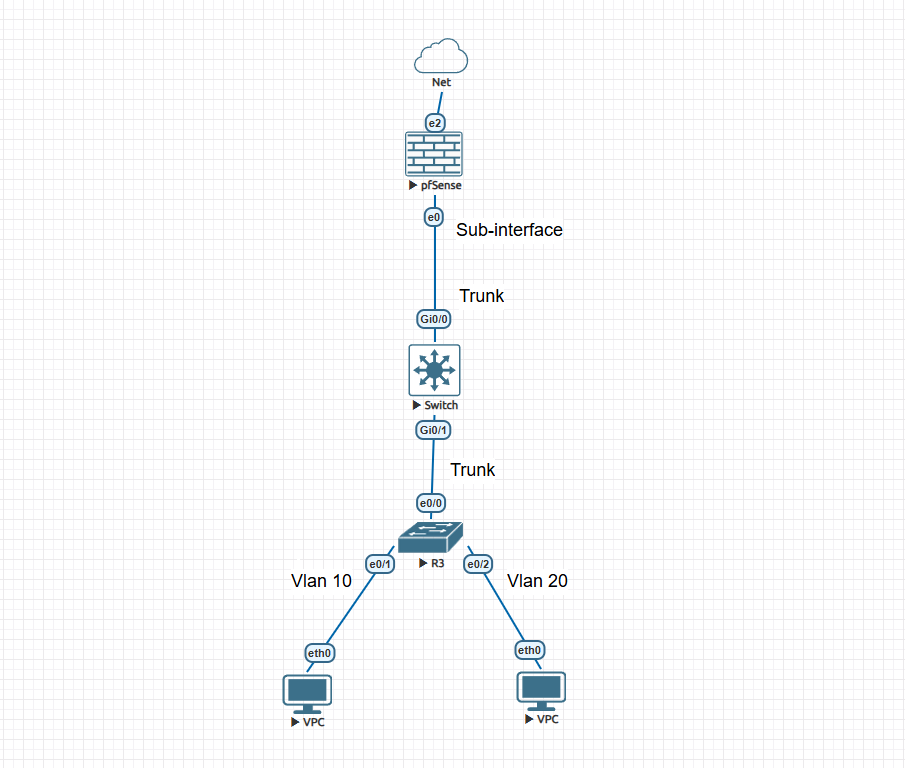

- Trên interface G0/0 của CoreSw:

    - Cấu hình mode trunk allow vlan 10, 20

    - Native vlan 1

- Trên interface e0 của pfSense:

    - sub-interface e0.10 vlan 10: 192.168.10.1/24

    - sub-interface e0.20 vlan 20: 192.168.20.1/24

## Nối thêm dây giữa CoreSw và pfSense để cấu hình LACP

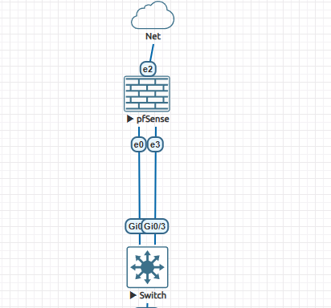

### Trên G0/3 mới của CoreSw

- Cấu hình trunk 

```
Coresw(config-vlan)#int g0/3
Coresw(config-if)#sw trunk encapsulation dot1q
Coresw(config-if)#sw mode trunk
Coresw(config-if)#sw trunk all vlan 10,20
```

- Cấu hình LACP duy nhất trên G0/3 trước

```
Coresw(config)#int g0/3
Coresw(config-if)#sw trunk encap dot1q
Coresw(config-if)#sw mode trunk
Coresw(config-if)#sw trunk all vlan 10,20
Coresw(config-if)#exit
Coresw(config)#int g0/3
Coresw(config-if)#channel-gr 1 mode active
Creating a port-channel interface Port-channel 1


Coresw(config)#int port-channel 1
Coresw(config-if)#sw trunk encapsulation dot1q
Coresw(config-if)#sw mode trunk
Coresw(config-if)#sw trunk all vlan 10,20
```

### Trên pfSense 
- Vào Interfaces -> LAGGs, bấm Add -> thêm e3 (e3 là cổng mới thêm vào trên pfsense và lấy riêng cổng mới đó cấu hình lagg)

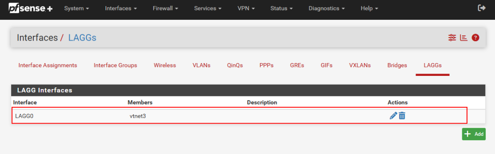   


- Vào Interfaces > VLANs, tạo sub-interfaces vlan trên nền của LAGG e3 vừa tạo


- Vào Interface/ interface Assignments để thay thế các sub-interface vlan cũ bằng sub-interface vlan vừa tạo 


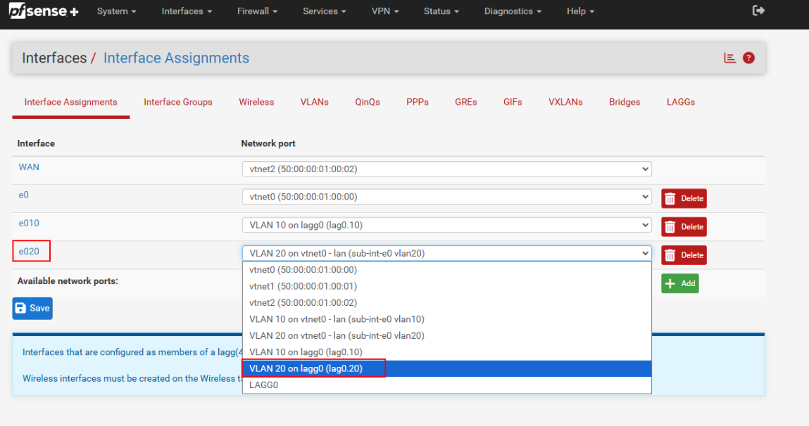 


- Sau đó nhấn delete interface e0 là cổng LAN duy nhất ban đầu -> save

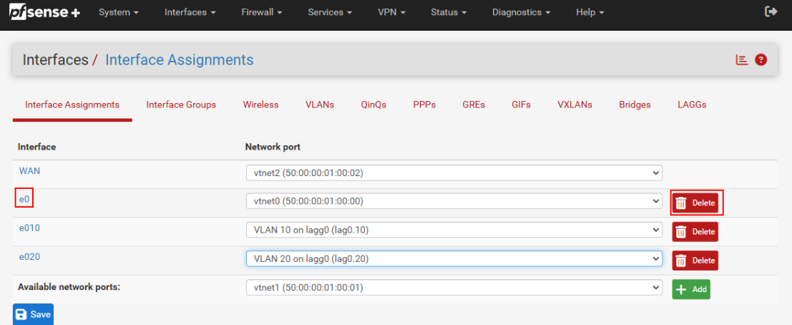  


- Kết quả : 

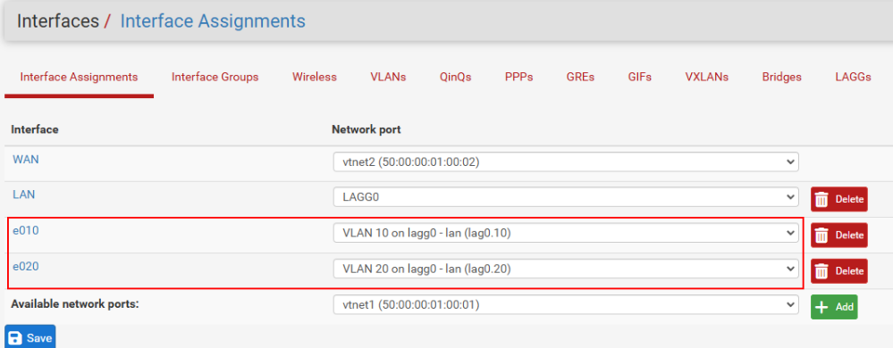   


### Quá trình gộp cổng

- Vào Interfaces > LAGGs, bấm Edit (cây bút) cái LAGG0.

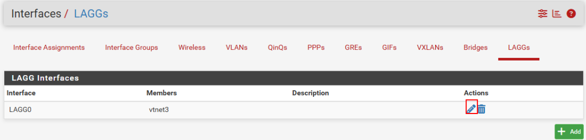    


- Tới đây chọn vtnet0 và vtnet3 (đẩy là cổng Lan ban đầu và cổng mới thêm), chọn LACP, rồi nhấn save 

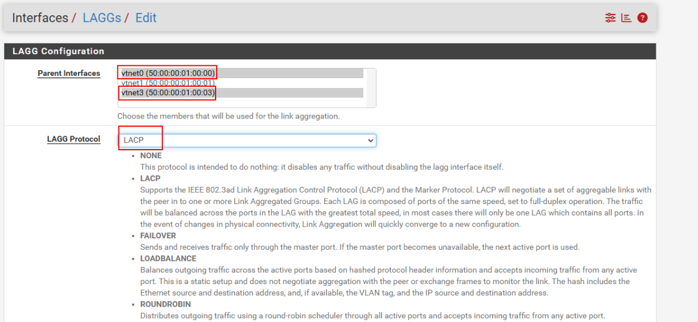    


- Vào Interfaces -> Interface Assignments -> Add cổng lagg0 (cổng vừa gộp)

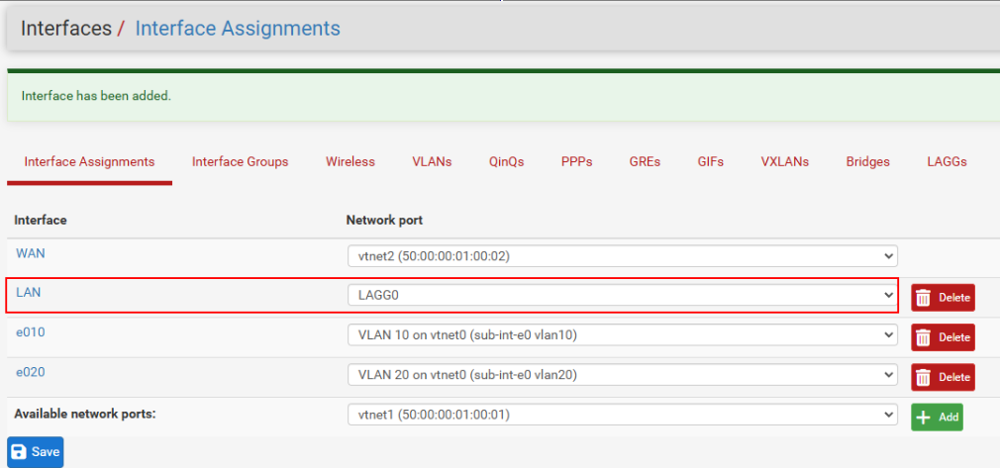    


- Sau đó vào cổng LAN (lagg0) đó để enable -> save

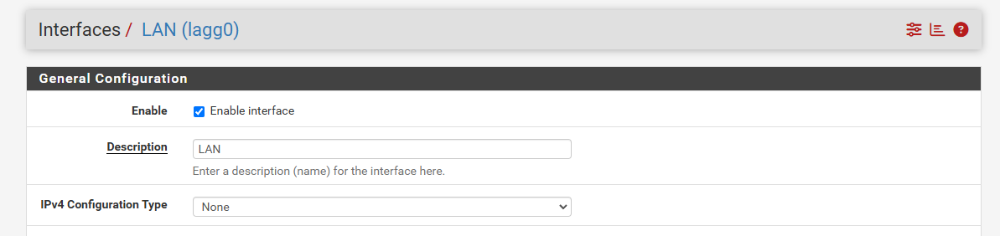   


- Vào interfaces/Vlan và xoá các interface vlan cũ

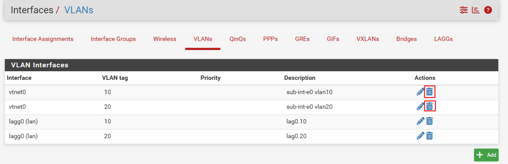

### Quay lại CoreSw để gộp cổng

```
Coresw#conf t
Enter configuration commands, one per line.  End with CNTL/Z.
Coresw(config)#int g0/0
Coresw(config-if)#channel-group 1 mode active
Coresw(config-if)#end
Coresw#wr
Building configuration...
[OK]
```


