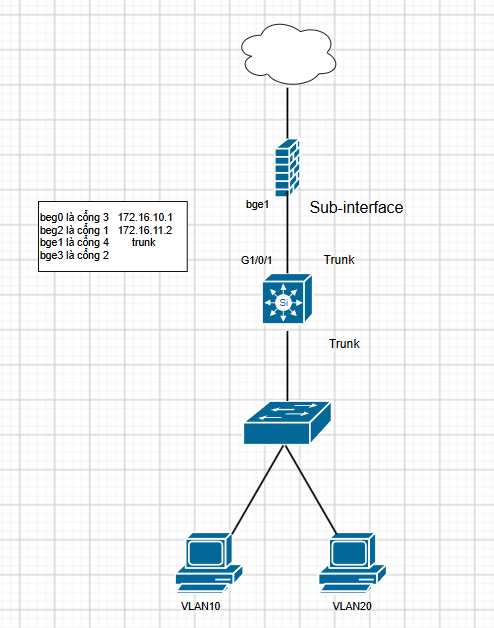
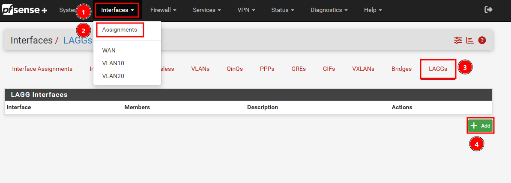
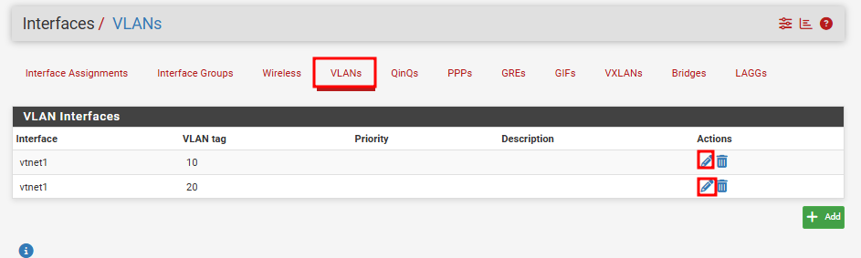
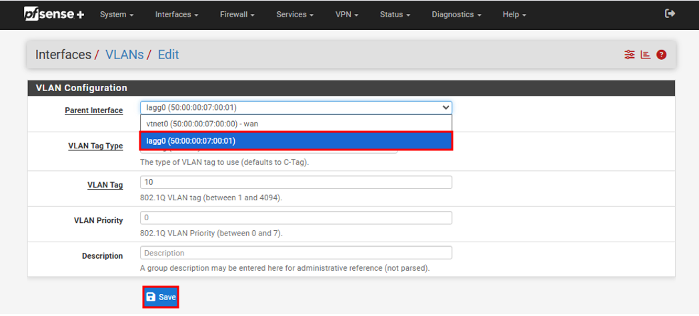
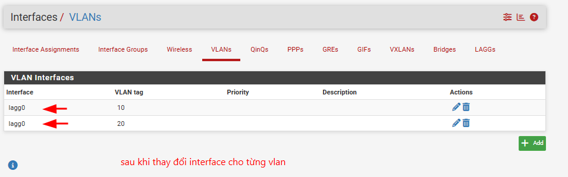

# Kế hoạch Thay thế Firewall pfSense cũ bằng Firewall pfSense mới downstream(Có LACP) 

Mục tiêu: Thay thế hoàn toàn thiết bị pfSense cũ (đang dùng 1 port LAN) sang thiết bị pfSense mới (sử dụng LACP bonding 2 port) với thời gian downtime (gián đoạn mạng) thấp nhất.

 


## Mục lục
- [1. Phương án thực hiện](#1-phương-án-thực-hiện)
- [2. Các bước thực hiện cụ thể](#2-các-bước-thực-hiện-cụ-thể)
  - [Giai đoạn 1: Chuẩn bị](#giai-đoạn-1-chuẩn-bị---không-gây-downtime)
  - [Giai đoạn 2: Cấu hình LAGG và Trunk trên Core Switch](#giai-đoạn-2-cấu-hình-lagg-và-trunk-trên-core-switch)
  - [Giai đoạn 3: Cấu hình Lagg trên pfsense](#giai-đoạn-3-cấu-hình-lagg-trên-pfsense)
  - [Giai đoạn 4: Chuyển đổi cáp vật lý và Kiểm tra](#giai-đoạn-4-chuyển-đổi-cáp-vật-lý-và-kiểm-tra)
- [3. Rủi ro lỗi ở các bước thực hiện](#3-rủi-ro-lỗi-ở-các-bước-thực-hiện)
- [4. Phương án Rollback (Nếu lỗi không khắc phục được)](#4-phương-án-rollback-nếu-lỗi-không-khắc-phục-được)

---

## 1. Phương án thực hiện

- **Chuẩn bị cấu hình Offline:** Thiết lập firewall pfSense mới chạy độc lập, không gắn vào mạng LAN hiện tại. Khôi phục (restore) toàn bộ cấu hình từ con cũ sang con mới, sau đó điều chỉnh lại Interface trên con mới từ port đơn thành LAGG (LACP). 
- **Cấu hình trên Core Switch:** Cấu hình sẵn Port-channel (LACP) trên 2 port mới của Switch nhưng tạm thời chưa cắm cáp vào pfSense mới.
- **Chuyển đổi:** Tắt cổng LAN nối từ Core Switch sang Firewall cũ. Nối 2 port mới trên Core Switch với 2 cổng trên Firewall mới. Do dùng chung cấu hình (đặc biệt là địa chỉ IP LAN và WAN) nên các thiết bị bên dưới sẽ tự động nhận diện thông qua bản cập nhật ARP.

--- 

## 2. Các bước thực hiện cụ thể

### Giai đoạn 1: Chuẩn bị - *Không gây downtime*

1. **Backup cấu hình từ Firewall cũ:**
   - Đăng nhập pfSense cũ, vào `Diagnostics > Backup & Restore`.
   - Tải file XML cấu hình hiện tại.
   
   

2. **Setup Firewall mới:**
   - Lắp đặt Firewall pfSense mới.
   - Restore file XML cấu hình vừa tải vào Firewall pfSense mới bằng cách: Vào `Diagnostics > Backup & Restore` > Chọn tệp XML > Bấm `Restore Configuration`. Sau đó đợi pfSense reboot.
   
   

   - *Lưu ý:* Trong quá trình reboot, pfSense có thể sẽ yêu cầu nhập password mới để hoàn thành.
   
### Giai đoạn 2: Cấu hình LAGG và Trunk trên Core Switch

1. Tạo một cổng portchannel mới trên CoreSw (g1/0/15, g1/0/16) và cấu hình trunk trên portchannel đó 

```cisco
CoreSw(config)#interface range g1/0/15,g1/0/16
CoreSw(config-if-range)#no shut
CoreSw(config-if-range)#switchport mode trunk
CoreSw(config-if-range)#switchport trunk allowed vlan 1,5,6,9,20,21,22,24,26,28,30,34,40,50,90,91,92
CoreSw(config-if-range)#channel-group 4 mode active
CoreSw(config-if-range)#interface po4
CoreSw(config-if)#switchport mode trunk
CoreSw(config-if)#switchport trunk allowed vlan 1,5,6,9,20,21,22,24,26,28,30,34,40,50,90,91,92
```

2. **Tắt cổng Trunk đang dùng trên Core Switch (downtime):**
   ```cisco
   CoreSw(config)# interface g1/0/1
   CoreSw(config-if)# shutdown
   ```

### Giai đoạn 3: Cấu hình Lagg trên pfsense

- Truy cập Web GUI pfSense qua IP WAN (172.16.11.2), không xoá interface LAN (bge1) hiện tại đang dùng, mà gộp luôn interface đó vào cùng với cổng mới để tạo LAGG (bge1 là cổng Trunk đang dùng, bge3 là cổng mới)



 


- Sau đó vào Interfaces/VLANs, thay interface của các vlan hiện tại bằng laggs vừa tạo. Điều này giúp tránh việc phải tạo thêm interface vlan mới.

 
 
 
 
 

### Giai đoạn 4: Chuyển đổi cáp vật lý và Kiểm tra

1. **Chuyển cáp hoàn thiện:**
   - Rút bỏ cáp cũ đang cắm ở cổng `g1/0/1` của Switch.
   - Sử dụng cáp mạng để nối: 1 sợi từ cổng `bge1 (4)` của pfSense sang `g1/0/15` của Switch, và 1 sợi nối từ cổng `bge3 (2)` sang `g1/0/16` của Switch (lúc này LACP sẽ hoạt động đồng bộ trên cả 2 đường).

2. **Kiểm tra trạng thái (Post-migration):**
   - Trên Core Switch, gõ lệnh `show etherchannel summary` để đảm bảo cả 2 cổng `g1/0/15` và `g1/0/16` đều có trạng thái `(P)`.
   - Ping test từ mạng LAN ra internet (VD: `ping 8.8.8.8`) để xác nhận hệ thống hoạt động ổn định.

3. **Nếu cổng Po4 lên thành công thì đưa interface trunk cũ về trạng thái default**
```
   CoreSw(config)# default interface GigabitEthernet 1/0/1
```
---

## 4. Phương án Rollback (Nếu lỗi không khắc phục được)

> [!CAUTION]
> Kích hoạt Rollback nếu vượt quá 5-10 phút không có Internet và không thể khắc phục nhanh.

1. **Khôi phục cấu hình pfSense:**
   - Truy cập giao diện web pfSense (qua IP cổng WAN (cổng số 1 - bge2) 172.16.11.2).
   - Vào `Diagnostics > Backup & Restore`, tải lên file XML đã backup ở Giai đoạn 1 và chọn `Restore Configuration`.
   - (Việc restore backup sẽ tự động đè lại trạng thái mạng ban đầu, bạn không cần phải tốn công xóa LAGG hay chỉnh sửa interface thủ công).

2. **Khôi phục Core Switch và Cáp mạng:**

    - Rút bỏ các sợi cáp LACP mới (`g1/0/15`, `g1/0/16`, `bge3`).

   - Cắm trả lại dây trunk vào cổng `g1/0/1` của Switch (đầu kia nối với `e1` của pfSense) như cũ.

   - Bật lại cổng LAN cũ trên Switch:
     ```cisco
     CoreSw(config)# interface g1/0/1
     CoreSw(config-if)# no shutdown
     ```

3. **Kiểm tra dịch vụ:**
   - Đợi pfSense khởi động xong, ping test từ mạng LAN ra `8.8.8.8` để đảm bảo mọi thứ đã trở lại bình thường.