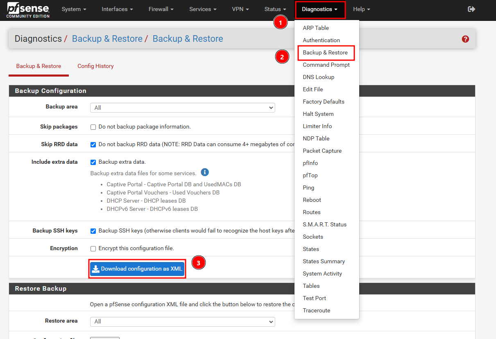
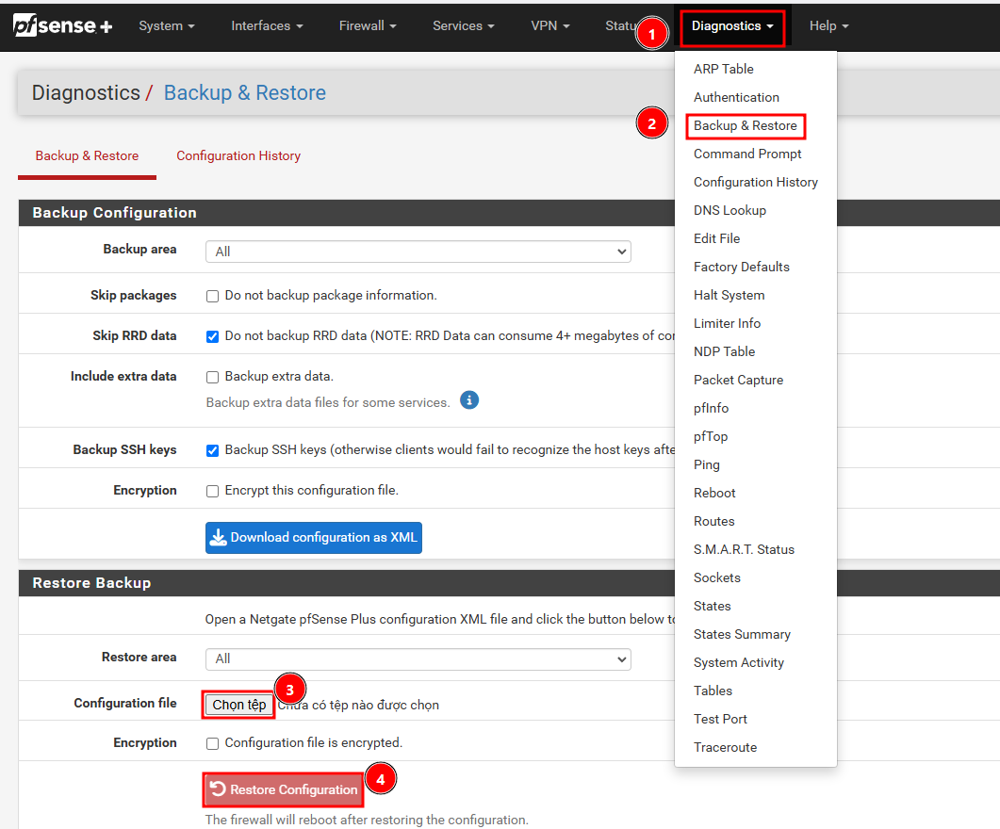
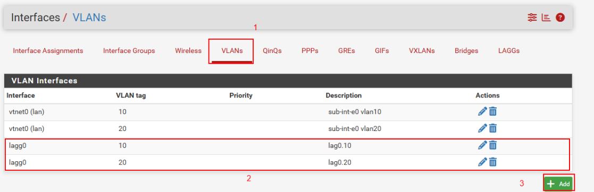
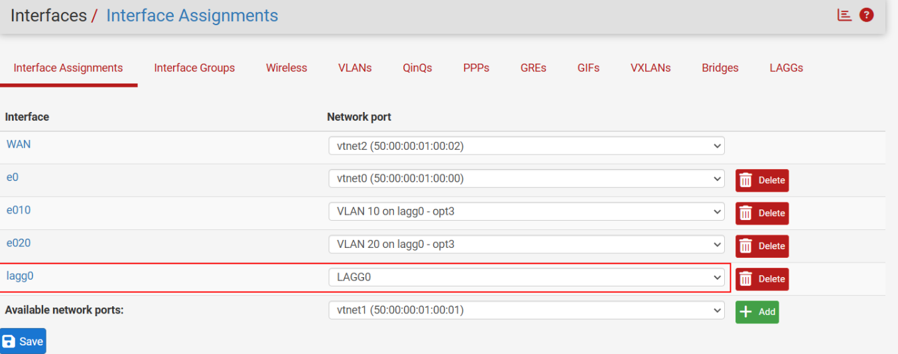
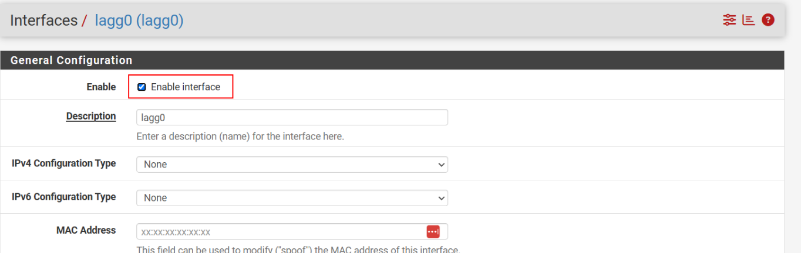
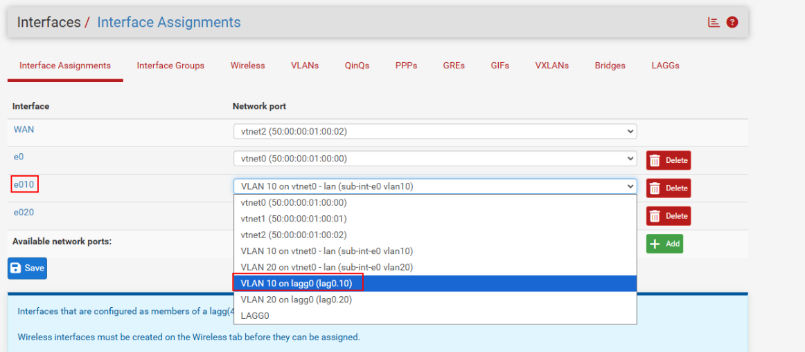
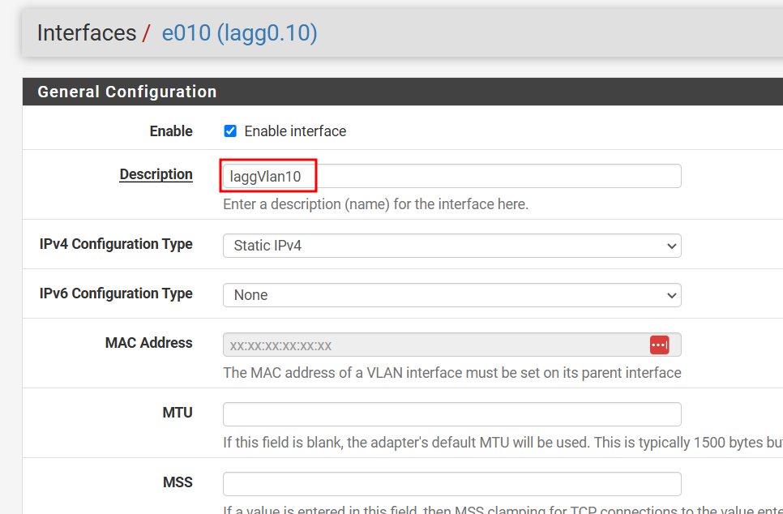
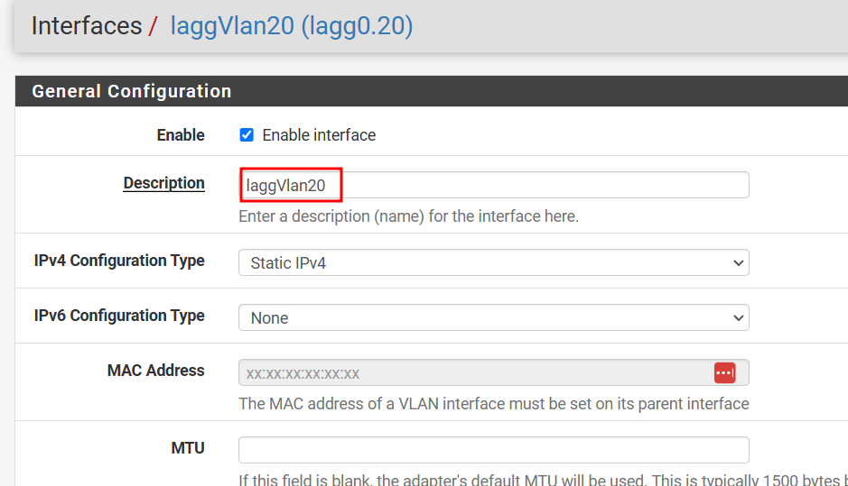
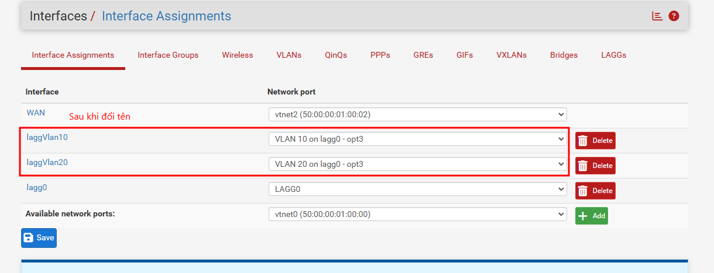

# Kế hoạch Thay thế Firewall pfSense cũ bằng Firewall pfSense mới (Có LACP)

Mục tiêu: Thay thế hoàn toàn thiết bị pfSense cũ (đang dùng 1 port LAN) sang thiết bị pfSense mới (sử dụng LACP bonding 2 port) với thời gian downtime (gián đoạn mạng) thấp nhất.

## Mục lục
- [1. Phương án thực hiện](#1-phương-án-thực-hiện)
- [2. Các bước thực hiện cụ thể](#2-các-bước-thực-hiện-cụ-thể)
  - [Giai đoạn 1: Chuẩn bị (Không gây downtime)](#giai-đoạn-1-chuẩn-bị---không-gây-downtime)
  - [Giai đoạn 2: Chuyển đổi (Cut-over)](#giai-đoạn-2-chuyển-đổi-cut-over---downtime-dự-kiến-1-5-phút)
  - [Giai đoạn 3: Kiểm tra (Post-migration)](#giai-đoạn-3-kiểm-tra-post-migration)
- [3. Rủi ro lỗi ở các bước thực hiện](#3-rủi-ro-lỗi-ở-các-bước-thực-hiện)
- [4. Phương án Rollback (Nếu lỗi không khắc phục được)](#4-phương-án-rollback-nếu-lỗi-không-khắc-phục-được)

---

## 1. Phương án thực hiện

- **Chuẩn bị cấu hình Offline:** Thiết lập firewall pfSense mới chạy độc lập, không gắn vào mạng LAN hiện tại. Khôi phục (restore) toàn bộ cấu hình từ con cũ sang con mới, sau đó điều chỉnh lại Interface trên con mới từ port đơn thành LAGG (LACP). 
- **Cấu hình trên Core Switch:** Cấu hình sẵn Port-channel (LACP) trên 2 port mới của Switch nhưng tạm thời chưa cắm cáp vào pfSense mới.
- **Chuyển đổi:** Tắt cổng LAN nối từ Core Switch sang Firewall cũ. Nối 2 port mới trên Core Switch với 2 cổng trên Firewall mới. Do dùng chung cấu hình (đặc biệt là địa chỉ IP LAN và WAN) nên các thiết bị bên dưới sẽ tự động nhận diện thông qua bản cập nhật ARP.

--- 

## 2. Các bước thực hiện cụ thể

### Giai đoạn 1: Chuẩn bị - *Không gây downtime*

1. **Backup cấu hình từ Firewall cũ:**
   - Đăng nhập pfSense cũ, vào `Diagnostics > Backup & Restore`.
   - Tải file XML cấu hình hiện tại.
   
   

2. **Setup Firewall mới:**
   - Lắp đặt Firewall pfSense mới.
   - Restore file XML cấu hình vừa tải vào Firewall pfSense mới bằng cách: Vào `Diagnostics > Backup & Restore` > Chọn tệp XML > Bấm `Restore Configuration`. Sau đó đợi pfSense reboot.
   
   

   - *Lưu ý:* Trong quá trình reboot, pfSense có thể sẽ yêu cầu nhập password mới để hoàn thành.
   
   - **Thiết lập LAGG trên pfsense mới và gán lại các VLAN (10, 20) vào interface `lagg0` thay vì port đơn như trước:**
     - Vào `Interfaces > LAGGs`, bấm **Add** > thêm `e3, e4` (giả sử `e3, e4` là 2 cổng mới thêm vào trên pfSense để dành riêng cho việc cấu hình LAGG).
     
         

     - Vào `Interfaces > VLANs`, tạo sub-interfaces VLAN trên nền của LAGG `e3, e4` vừa tạo.
     
     

     - Vào `Interfaces > Interface Assignments`, add thêm interface `lagg0` và `Enable` nó lên.
     
     
     <br>
     

     - Vẫn ở `Interfaces > Interface Assignments`, thay thế các sub-interface VLAN cũ bằng sub-interface VLAN mới vừa tạo trên nền LAGG.
     - Việc thay thế này sẽ giúp giữ nguyên mọi cấu hình ban đầu trên các interface cũ như IP, VLAN, DHCP, Rules..., chỉ thay đổi interface vật lý.
     
     
     <br>
      

     - Xóa interface cũ (`e0`) và các sub-interface đi kèm của nó.
     
     
     <br>
     

     - Đổi tên các interface vừa thay thế:

     
     <br>
     
     <br>
     

3. **Chuẩn bị Core Switch:**
   - Trên 2 port trống trên Core Switch (VD: G0/3, G1/0), cấu hình Port-Channel (LACP mode active), sau đó cấu hình Trunk allow các VLAN tương ứng trên port-channel này.

   - **Cấu hình LACP và Trunk trên Core Switch:**
     *(Theo chuẩn Cisco, bạn chỉ cần gộp port vật lý vào LACP, sau đó cấu hình Trunk trên giao diện Port-channel ảo, cấu hình này sẽ tự động ép xuống 2 port vật lý để tránh lỗi bất đồng bộ).*
     ```cisco
     CoreSw(config)# int range g0/3, g1/0
     CoreSw(config-if-range)# channel-group 1 mode active
     CoreSw(config-if-range)# exit

     CoreSw(config)# int port-channel 1
     CoreSw(config-if)# sw trunk encapsulation dot1q
     CoreSw(config-if)# sw mode trunk
     CoreSw(config-if)# sw trunk allowed vlan 10,20
     CoreSw(config-if)# end
     CoreSw# wr
     ```

### Giai đoạn 2: Chuyển đổi (Cut-over) - *Downtime dự kiến 1-5 phút*

1. **Tắt Firewall cũ (Bắt đầu tính Downtime):**
   - Trên Core Switch: Thực hiện lệnh `shutdown` port LAN nối với con pfSense cũ. (giả sử cổng g0/0 là cổng LAN cũ)

      ```cisco
      CoreSw(config)# int g0/0
      CoreSw(config-if)# shutdown
      CoreSw(config-if)# end
      CoreSw# wr
      ```

   - Rút cáp mạng cổng WAN của con pfSense cũ.

2. **Bật Firewall mới:**
   - Cắm cáp WAN vào cổng WAN của con pfSense mới.
   - Nối cáp mạng từ 2 cổng mới trên pfSense vào 2 cổng vừa cấu hình LACP trên Core Switch.
   - Đợi cho Switch và pfSense thỏa thuận giao thức LACP thành công.

### Giai đoạn 3: Kiểm tra (Post-migration)

1. Trên Core Switch chạy lệnh `show etherchannel summary` để kiểm tra LACP đã "UP" đều cả 2 cổng hay chưa.
2. Vào `Status > Interfaces` hoặc `Diagnostics > LAGG` trên pfSense mới để xác nhận lagg0 đang ở trạng thái ACTIVE trên cả 2 cổng.
3. Ping kiểm tra từ máy tính thuộc mạng VLAN ra Internet (IP WAN) và DNS (8.8.8.8).
4. Kiểm tra các dịch vụ Publish ra ngoài (Port Forwarding, VPN) xem có hoạt động bình thường không.

---

## 3. Rủi ro lỗi ở các bước thực hiện

> [!WARNING]
> Những rủi ro sau có thể làm gián đoạn chuyển đổi.

- **Rủi ro 1: Lỗi Restore cấu hình dẫn đến mất kiểm soát con mới.** File cấu hình (XML) của phiên bản pfSense cũ không tương thích với phiên bản pfSense mới.
- **Rủi ro 2: Lỗi LACP không up.** Mặc dù đã chuẩn bị offline, nhưng khi chuyển đổi, Switch và pfSense không thỏa thuận được LACP, làm kết nối LAN chập chờn hoặc rớt gói tin.
---

## 4. Phương án Rollback (Nếu lỗi không khắc phục được)

> [!CAUTION]
> Kích hoạt Rollback nếu vượt quá 10 phút không có Internet và không thể truy vết lỗi nhanh.

1. **Trên Core Switch:** 
   - `shutdown` ngay lập tức 2 port LACP nối với firewall mới (G0/3, G1/0).
   - `no shutdown` mở lại port kết nối với firewall cũ.
2. **Kéo lại cáp WAN:**
   - Rút cáp WAN khỏi Firewall mới, cắm trả lại vào cổng WAN của Firewall cũ.
3. **Kiểm tra dịch vụ:**
   - Kiểm tra mạng xem đã trở lại bình thường chưa. (Quá trình rollback này thường chỉ mất 1-2 phút do firewall cũ chưa hề bị thay đổi cấu hình hay xóa bỏ, vẫn đang ở trạng thái sẵn sàng).
